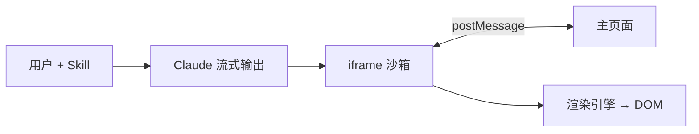
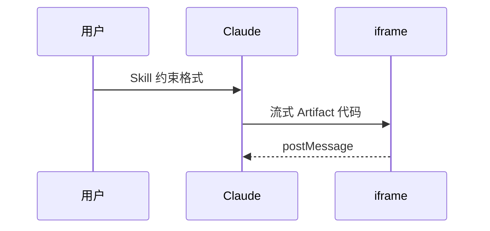

# 技术博客写作

## Overview

好技术博客不是功能说明书，而是**用一个问题牵引读者、用经验支撑论点、用结构降低认知负担**的文章。核心原则：先回答「读者为什么要关心」，再展开「是什么 / 怎么做 / 何时不用」。

## When to Use

- 写产品技术拆解（某产品如何实现 X、为何这样设计）
- 写领域技术科普（Agent、RAG、多模态等概念与工程实践）
- 改稿：文章像文档堆砌、缺少观点、读者看不到取舍理由

**不要用：** 纯新闻稿、版本发布公告、无技术深度的营销文。

## 文章类型与选题

| 类型 | 读者诉求 | 标题模式 | 核心交付 |
|------|----------|----------|----------|
| 产品技术拆解 | 「它怎么做到的？」 | `产品/功能 + 工程问题` | 架构、关键决策、权衡 |
| 领域技术深潜 | 「我该怎么用/理解？」 | `概念 + 实践价值` | 心智模型、模式、陷阱 |
| 经验复盘 | 「踩坑后学到了什么？」 | `问题 + 我们怎么做` | 根因、方案、可复用原则 |

选题自检：能否用一句话说清**读者读完后能做什么**？不能则收窄范围。

## 文章结构

### 通用骨架（推荐）

```
1. 开篇钩子     — 工程问题 / 痛点 / 反直觉结论（1–2 段）
2. 定义与边界   — 术语、与相近概念对比、适用/不适用场景
3. 核心内容     — 由浅入深：基础块 → 模式 → 进阶
4. 实战/案例    — 代码、架构图、真实取舍
5. 常见陷阱     — 失败模式 + 修复
6. 收束         — 3 条以内原则，不重复正文
```

### 产品拆解专用

1. **问题先行**：「随着 X 变复杂，工程问题是 Y」—— 不是「今天我们发布 Z」
2. **分层展开**：基础组件 → 组合模式 → 完整系统（参考 Anthropic workflow/agent 递进）
3. **显式权衡**：延迟 vs 准确率、简单 vs 灵活、成本 vs 自主性
4. **When / When not**：每个模式配「适合 / 不适合」及反例

### 领域科普专用

1. **对比框**：`X vs Y`（如 prompt engineering vs context engineering）
2. **心智模型**：一个类比贯穿全文（侦探笔记本、注意力预算、流水线）
3. **最小可行认知**：先让读者跑通一个最小例子，再加深
4. **原则收束**：「最小高信号信息集」类可执行准则

## 写作技巧（来自 Anthropic / OpenAI / Claude 工程博客）

### 开篇

- **坏**：「本文介绍 X 的功能。」
- **好**：「当 agent 能力增强，爆炸半径也在增大。工程问题是：如何限制它？」

首段承诺读者收益：学完能**做决策**或**避坑**，不是罗列目录。

### 段落与节奏

- 一段一个观点；段首句即论点
- 复杂流程用编号步骤；并列选项用表格
- 代码块前写**为何需要这段代码**；后写**输出/边界**
- 术语首次出现即定义，不假设「大家都懂」

### 论证方式

- **生产经验作证据**：「我们在 N 个团队看到…」「客户场景显示…」
- **失败模式对称**：描述两个极端（过度工程 vs 过于模糊）及中间地带
- **引用专家原话**（案例文）：`> 引用` 增强可信度，紧跟一句你的解读
- **数字要有语境**：不说「提升 50%」，说「发布前操作从 P80 230 步降到 120 步」

### 可视化

**架构图、流程图、时序图一律用 Mermaid**，不要用 ASCII 字符画。本项目 MDX 支持 ` ```mermaid ` 代码块，构建后由客户端渲染为 SVG（见 `src/plugins/remark-text-diagram.mjs`）。

优先顺序：**Mermaid 图** > 表格 > 纯文字步骤

| 场景 | 推荐图表类型 |
|------|--------------|
| 组件/模块关系 | `flowchart LR` 或 `flowchart TB` |
| 请求/消息往返 | `sequenceDiagram` |
| 状态迁移 | `stateDiagram-v2` |

写法示例（直接嵌入 `src/content/blog/*.mdx` 正文里）：

````mdx

````

````mdx

````

注意：

- 节点标签用中文短句，避免一行过长；必要时用 `<br/>` 换行
- 一张图只表达一个论点；复杂系统拆成 2–3 张，不要堆满一张
- 图前后各用 1–2 句说明「为何需要这张图」和「读图要点」
- 并列对比、字段清单仍用表格；Mermaid 不替代表格

### 语气

- 自信但谦逊：「我们建议」优于「你必须」；承认未知与权衡
- 中文完整句，不用电报体；技术术语保留英文时首次中英并注
- 避免空洞形容词：「强大的」「颠覆性的」→ 换成可验证描述

## 本项目发布格式

文章存于 `src/content/blog/*.mdx`，frontmatter：

```yaml
---
title: "动词或问题导向的标题"
description: "一句话说明读者读完能学到什么（不剧透全文）"
pubDate: 2025-06-15
updatedDate: 2025-06-16  # 可选，重大修订时填写
tags: ["架构设计", "Agent"]       # 2–4 个，主题关键词
techDomain: ["记忆"]               # 技术领域，驱动首页「技术领域」筛选
product: ["Claude Design"]         # 关联产品，驱动首页「产品」筛选
---
```

### 三个标注字段的分工

| 字段 | 用途 | 填写时机 | 示例 |
|------|------|----------|------|
| `tags` | 文章主题关键词，展示在卡片上 | 每篇都填，2–4 个 | `["工程实践", "Tool Use"]` |
| `techDomain` | 所属技术领域，首页侧栏筛选 | 文章讨论某技术方向时填 | `["记忆"]`、`["自进化"]` |
| `product` | 拆解/涉及的产品，首页侧栏筛选 | 产品技术拆解时填 | `["Claude Design"]` |

- 不适用则写空数组 `[]`，不要省略字段
- 筛选项从全站文章**动态聚合**，新值首次出现即自动出现在筛选栏
- 命名保持一致：产品用官方写法（如 `Claude Design`），技术领域用简短中文（如 `记忆`、`多智能体`）
- 一篇可标多个领域/产品，但通常 1–2 个即可，避免泛化（如不要每篇都标 `["Agent"]`）

**标题**：8–20 字，信息密度高；可含核心概念名。
**description**：回答「谁该读 + 收获什么」，不写「本文将介绍…」。

## 改稿检查清单

- [ ] 首段 30 秒内能看懂**核心问题**
- [ ] 每个二级标题下，删掉该节不影响主线则删节
- [ ] 至少一处 **When not to use** 或等价的边界说明
- [ ] 涉及架构/流程时至少一张 Mermaid 图（` ```mermaid ` 代码块）
- [ ] 至少一个表格、图或代码块承载「不可用文字替代」的信息
- [ ] 结尾是**原则**而非**摘要复读**
- [ ] 技术论断有依据（实测、官方文档、可复现步骤）
- [ ] `techDomain` / `product` 与正文匹配；无关则留 `[]`

## Common Mistakes

| 错误 | 修复 |
|------|------|
| 功能清单式写作 | 改为「问题 → 方案 → 权衡」叙事 |
| 只有 What 没有 Why | 每节首句补「为何读者需要知道」 |
| 堆术语不定义 | 首次出现给一句话定义 + 链接/脚注 |
| 缺少边界 | 加「不适用场景」防止读者误用 |
| 结尾变成目录复述 | 收束为 2–3 条可带走的决策原则 |
| 代码无上下文 | 代码前写场景，后写预期与局限 |
| 把 tags 当筛选维度乱填 | `tags` 写主题；领域/产品归 `techDomain` / `product` |
| 每篇都标相同领域 | 只标与正文强相关的 1–2 个，否则筛选失效 |
| 用 ASCII 画架构图 | 改用 Mermaid 代码块，见「可视化」一节 |

## Quick Reference

| 阶段 | 动作 |
|------|------|
| 选题 | 一句话读者收益；不匹配则收窄 |
| 大纲 | 问题 → 定义 → 核心 → 案例 → 陷阱 → 原则 |
| 初稿 | 先写正文，后打磨标题/描述 |
| 改稿 | 跑检查清单；删冗余节 |
| 发布 | 填 frontmatter；`tags` 2–4 个；按需填 `techDomain` / `product` |
