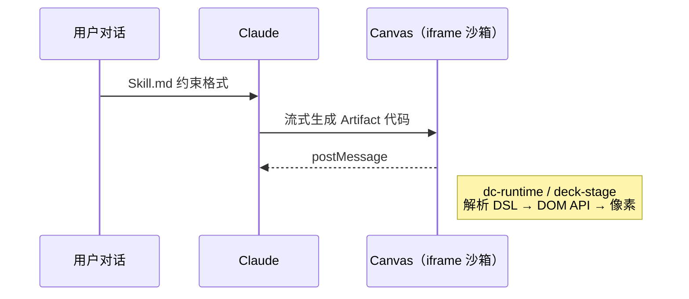

当大模型开始直接产出 HTML、React 组件甚至整份 PPT 时，工程问题立刻变得尖锐：**这些代码要在用户的浏览器里执行，但绝不能碰到主站的 cookie、会话和 DOM。** 同时还要边生成边显示，不能等整份 Artifact 落盘后再刷新。

Claude Design 的答案不是「让模型写标准网页」，而是搭了一条专用流水线：**Skill 规定输出格式 → Claude 按格式生成代码 → 独立渲染引擎解析执行 → Canvas iframe 里绘制像素。** 读完这篇，你能把右侧 Artifact 面板里发生的事，从黑盒还原成可推理的架构。

## 一张图看懂全局

四个角色各司其职：**Skill 是契约**，**Claude 是生产者**，**渲染脚本是消费者**，**iframe 是隔离边界**。下面按这个顺序展开。

## 为什么必须进 iframe

Artifact 内容运行在 Canvas 右侧的 iframe 里，与 claude.ai 主页面**物理隔离**。原因很简单：生成的 JS 是用户可控输入，一旦与主站同域，就可能读取 cookie、篡改会话、探测主页面数据。

iframe 与主页面的**唯一合法通道**是 `postMessage`——双向传递控制指令和状态，不共享 DOM、不共享存储。这是典型的「不可信代码执行」模型：把爆炸半径锁在沙箱内，主站只通过消息协议与之协作。

| 能力 | 主页面 | iframe 沙箱 |
|------|--------|-------------|
| 访问 claude.ai cookie | ✓ | ✗ |
| 执行生成代码 | ✗ | ✓ |
| 与对端通信 | postMessage | postMessage |
| 流式更新 UI | 发指令 | 消费并局部渲染 |

**何时这套隔离显得过重：** 若 Artifact 只是静态 Markdown 预览、不需要执行 JS，单独 iframe + 渲染引擎就是过度设计。Claude Design 面向的是**可交互、可流式、可执行**的产出，隔离是前提而非选项。

## 渲染引擎：一种 Artifact，一个脚本

每种 Artifact 类型对应独立的 JS 渲染脚本，引擎负责「读懂模型输出 → 调用浏览器 DOM API → 最终绘制」：

| Artifact 类型 | 渲染脚本 | 技术栈 |
|---------------|----------|--------|
| HTML / 简历 | `support.js`（dc-runtime） | 自定义 DSL + DOM |
| React | （内置于对应管线） | React 组件树 |
| PPT | `deck-stage.js` | Web Component |

**渲染的本质**始终是：JS 解析模板或组件描述，操作 DOM，浏览器完成绘制。区别只在于「模板长什么样」——标准 HTML、React JSX，还是下面要说的 dc DSL。

## 标准 HTML 不够，所以要有 JS

静态 HTML 是文档，不是运行时。下面三件事，单靠 HTML 做不了，必须靠 JS：

1. **流式更新** — 模型边吐 token，边刷新画面
2. **数据绑定** — 同一份模板，不同数据实例
3. **响应外部指令** — 主页面通过 postMessage 驱动翻页、高亮、重渲染

因此 Claude Design 不是「模型写个 `.html` 文件丢进 iframe」，而是「模型写**引擎能消费的格式**，引擎负责把格式变成活 DOM」。HTML 与 JS 的分工在这里很清晰：**HTML/DSL 描述结构，JS 负责解释与生命周期。**

## dc-runtime：浏览器不认识的自定义标签

简历和 HTML 组件走 **dc-runtime**（内部代号 **DC = Design Component**）。它定义了一套浏览器原生不解析的 DSL，只有 `support.js` 认识：

| 标签 / 语法 | 作用 |
|-------------|------|
| `<x-dc>` | 入口边界，告诉引擎从何处开始解析 |
| `<helmet>` | 把内容注入 `<head>`（标题、meta、样式链接） |
| `<sc-for>` | 循环渲染，把静态 HTML 变成模板 |
| `{{变量}}` | 数据插值 |

浏览器看到这些标签会当作未知元素忽略；**语义完全由 dc-runtime 在运行时补全。** 这和 Vue 的 `v-for`、React 的 JSX 是同一类思路：在标准 Web 平台上叠一层受控语法，让模型输出既结构化又比纯 JS 更稳定。

PPT 则有另一套内部代号 **omelette**（可从 `__omelette_presenting` 等 API 名推断），由 `deck-stage.js` 驱动，走 Web Component 路线——说明 Claude Design 没有强行用一种渲染器覆盖所有类型，而是**按产物形态选最省事的解释路径**。

## Skill：让模型和引擎说同一种语言

`Skill.md` 规定 Claude 生成代码时必须遵守的格式约定。渲染引擎只消费符合契约的输入；模型则被训练成稳定输出该格式。

可以把 Skill 理解成 **OpenAPI 之于 REST 客户端**：没有契约，生产者（模型）和消费者（引擎）会对不齐，流式解析更是灾难。Skill 与引擎是**配套设计**的——改 DSL 就要改 Skill，改 Skill 就要改引擎，三者版本必须一起走。

这也是为什么你在 Claude Design 里看到的简历、海报、幻灯片，风格上会比「随便让模型写一个 HTML 文件」整齐得多：不是模型突然变乖了，而是**输出空间被刻意收窄了**。

## 设计系统 CSS：生成也要讲审美

Claude Design 支持导入现有代码或 Figma 的 `.fig` 文件，系统会提取颜色、字体、间距等设计元素，形成可复用的设计系统 CSS。后续生成 Artifact 时，Claude 会参考这套约束，而不是每次从零配色。

这是产品层对「工程契约」的延伸：Skill 管结构和语法，设计系统管视觉一致性。两者叠加，减少「能跑但很丑」或「每次风格漂移」的问题。

## 流式渲染：边生成边看见

简历等组件能边生成边显示，靠的是流式管线：

1. Claude 持续推送增量片段到 iframe
2. dc-runtime 通过 `dcUpdate()` 接收增量
3. 引擎**局部更新**已挂载的组件树，而不是整页 `innerHTML` 重写

全量重绘在流式场景下既慢又闪屏；局部更新把「生成体验」和「最终一致性」绑在一起。代价是引擎必须能处理**不完整输入**——DSL 解析器要能容忍中间态，并在下一段到达时修正，这比一次性渲染难一个数量级。

## 常见误解与边界

| 误解 | 实际 |
|------|------|
| 「Canvas 里就是普通网页」 | 是沙箱 + 专用 DSL，不是任意 URL |
| 「模型直接写 React 就能跑」 | 仍要经过对应渲染管线和 Skill 约束 |
| 「postMessage 是优化项」 | 是唯一合法跨域协作方式，不是可选项 |
| 「一种渲染器搞定所有 Artifact」 | HTML/简历、React、PPT 分属不同脚本与代号体系 |

若你的场景只是展示模型生成的纯文本或代码高亮，不需要复刻 Claude Design 全栈；但若要做**不可信代码执行 + 流式 UI + 多形态 Artifact**，这套分层几乎不可避免。

## 三条可带走的工程原则

1. **先划边界，再谈体验** — iframe 沙箱 + postMessage 解决的是安全；流式渲染解决的是体验；两者不能互换。
2. **收窄输出空间比提升模型智商便宜** — Skill + DSL + 设计系统，是用格式约束换稳定性和可解析性。
3. **一种产物一种引擎** — 简历（dc-runtime）、PPT（omelette/deck-stage）、React 各走各的管线，比万能渲染器更可维护。

Claude Design 看起来是「聊天框右边多了一个预览」，底层却是完整的**受控代码生成与执行平台**。理解这条链路，再去看其他产品的 Artifact、Canvas 或 Code Interpreter 类能力，会更容易判断：他们隔离了什么、约束了什么、以及流式更新发生在哪一层。
