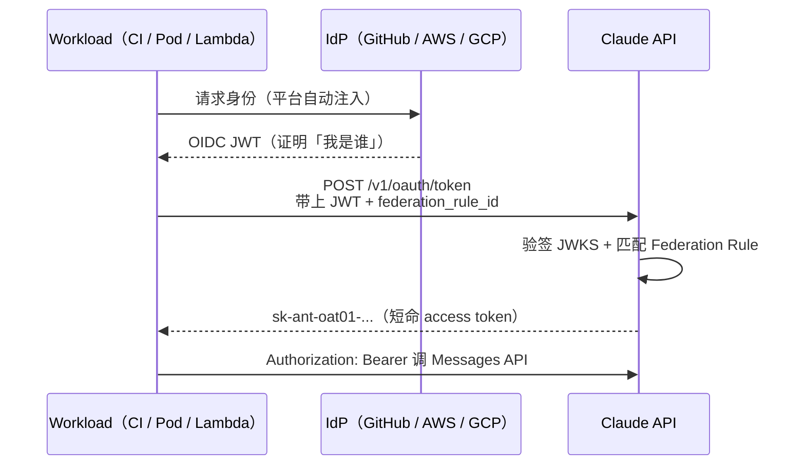

## 问题：静态 API Key 必须分发，分发就会泄露

让 CI 流水线或 K8s Pod 调 Claude，最常见的起手式是：在 Console 生成 `sk-ant-...`，贴进 GitHub Secrets 或 Kubernetes Secret，然后忘掉它。

这是静态长期凭证的结构性缺陷：**它必须被复制到每一个运行环境，每多一份就多一个泄露面；泄露了可能很久不知道；一旦泄露，攻击者可以从任何地方冒充你调用 API。**

[Workload Identity Federation（WIF）](https://platform.claude.com/docs/en/manage-claude/workload-identity-federation) 的答案和 Vercel Connect 表面相似——**不存密钥，按需换取**——但方向恰好相反。我最初把方向搞反了，也以为只有一个 Token，还和出站凭证代理混为一谈。下面按我踩过的三个盲区展开。

<details>
<summary>概念补充：从 Workload 到 Access Token</summary>

**Workload（工作负载）** — 需要调用 Claude API 的程序实体。不是人，是机器：一个 GitHub Actions 流水线、一个 AWS Lambda 函数、一个 K8s Pod。它有自己的运行身份，但没有「账号密码」。

**Issuer（颁发机构）** — Workload 所属的外部身份系统，负责给 Workload 签发 token。GitHub 是 Issuer，AWS STS 是 Issuer，Okta 也是。Claude Platform 通过 Issuer 的公钥来验证 token 是否真实可信，防止伪造。

**OIDC Token（令牌）** — Issuer 给 Workload 颁发的临时身份证明，JWT 格式，带签名、有过期时间，不是静态的。Workload 在换票时用它来证明「我是谁」——**注意：这张票本身不能直接调 Claude API**。

**Claims（声明字段）** — OIDC Token 内部的具体信息字段，是 Federation Rule 进行匹配的原材料：

| Claim | 含义 | 示例 |
|-------|------|------|
| `iss` | 我从哪个 Issuer 来 | `https://token.actions.githubusercontent.com` |
| `sub` | 我具体是谁 | `repo:acme/app:ref:refs/heads/main` |
| `aud` | 我是给谁用的 | 你配置的 audience 值 |
| 自定义字段 | 环境、分支等上下文 | `environment`、`ref`… |

**Federation Rule（联邦规则）** — 整个机制的核心配置。格式是「如果 Claims 满足 X 条件，则映射到 Service Account Y」。它是两个身份域之间的外交协议：有条件、可撤销、可审计。客户端换票时**显式指定** `federation_rule_id`，平台不会自动替你搜索匹配。

**Service Account（服务账号）** — Workload 在 Claude Platform 内部的身份代理。通过 Rule 映射后，Workload 以这个非人类身份行动，用量和限速归因到对应 workspace。和 API Key 的本质区别：Key **本身就是凭证**；Service Account **本身不是凭证**，凭证按需签发、可追溯到具体 workload。

**Role（角色）** — 绑定在 Service Account 上的权限集合，粗粒度的权限分组——比如「只能调用模型」、「可以管理组织成员」。Claude Console 里没有单独的 Role 资源，但 Service Account 加入哪些 workspace、Rule 授予什么 scope，合起来等价于这个角色定义。

**Scope（权限范围）** — 在角色基础上进一步收窄的具体权限项，由 Federation Rule 配置。默认 `workspace:developer`，权限等同该 workspace 的 API Key；部分产品场景会锁定为更窄的 scope（如 `org:manage_tunnels`）。实现最小权限：不同 Rule 可以给不同 workload 不同的 scope。

**Access Token（访问令牌）** — Rule 匹配成功后，Claude Platform 颁发给 Workload 的短期令牌（`sk-ant-oat01-...`）。用这个 token 实际调用 Claude API。短命，过期失效，泄漏了危害也极小。SDK 会在过期前自动刷新。

**Audit Trail（审计轨迹）** — 每一次 token 交换、每一次 API 调用，都记录在对应 Service Account 名下。出了问题可以精确追溯到哪个 workload、什么时间、做了什么——而不是「某把共享 API Key 被谁用了」这种模糊归因。

**WIF（Workload Identity Federation）** — 以上所有机制的总称。核心价值：用跨域联邦认证替代静态 API Key，让外部身份直接换取内部权限，整个过程无需人工介入、无需密钥分发。

</details>

## WIF 是什么：你的 Workload 来连 Claude，不是 Claude 去连 AWS

一句话定位：**用你已有平台身份（AWS、GCP、GitHub Actions 等）换 Claude 短期 token，消灭 `.env` 里的 `sk-ant-...`。**

我最初的误解是：WIF 让 Claude 去连 AWS/GCP 做身份验证。实际上 AWS、GCP、GitHub 在这里是 **Issuer（身份来源）**，不是被调用的目标服务。跑在它们上面的 **Workload 才是调用方**，Claude API 是**被调用方**。

| 角色 | 实际含义 |
|------|----------|
| AWS / GCP / GitHub Actions | 签发 OIDC JWT 的公证处（Issuer） |
| 你的 CI、Pod、Lambda | 拿着身份证来换工牌的 Workload |
| Claude API | 验票后发短期 access token 的被调用方 |

方向搞对之后，后面两件事才说得通。

## 两步换票：Issuer 发第一张，Claude 发第二张

第二个盲区：我以为 GitHub Actions 吐出来的 OIDC Token 就是调 Claude 用的最终凭证。

实际上是**两次交换，两张票，用途完全不同**：



1. **IdP 发 OIDC JWT** — 证明「这个 workload 来自 `repo:acme/app:ref:refs/heads/main`」或「这个 Pod 是 `prod:worker`」。这张票**不能直接调 Claude**。
2. **Claude 验票后发 `sk-ant-oat01-...`** — 通过 RFC 7523 `jwt-bearer` grant 交换，绑定到你配置的 Service Account，寿命通常几十分钟到几小时。SDK 会在过期前自动刷新。

底层 HTTP 长这样（摘自[官方文档](https://platform.claude.com/docs/en/manage-claude/workload-identity-federation)）：

```bash
# 1. 从平台拿到 IdP JWT（GitHub Actions 自动注入，K8s 用 projected token…）
JWT=$(cat /var/run/secrets/anthropic.com/token)

# 2. 交给 Claude 换短期 access token
curl -sS https://api.anthropic.com/v1/oauth/token \
  -H "content-type: application/json" \
  --data "{
    \"grant_type\": \"urn:ietf:params:oauth:grant-type:jwt-bearer\",
    \"assertion\": \"$JWT\",
    \"federation_rule_id\": \"fdrl_...\",
    \"organization_id\": \"...\",
    \"service_account_id\": \"svac_...\",
    \"workspace_id\": \"wrkspc_...\"
  }"

# 3. 用返回的 access_token 调 API
```

两张票的分工：**第一张证明来源可信，第二张才是 API 调用凭证。** 搞混这一步，配置文档读起来就像天书。

## 三件套：Issuer、Rule、Service Account

Claude Console 里要配三个资源，合起来表达一句话：**「Issuer X 签发的、满足条件 Y 的 JWT，可以冒充 Service Account Z 行动。」**

| 原语 | ID 前缀 | 是什么 |
|------|---------|--------|
| **Federation Issuer** | `fdis_...` | 注册一家公证处：「我信任 `https://token.actions.githubusercontent.com` 签的 JWT」 |
| **Federation Rule** | `fdrl_...` | 换票规则：「什么条件的身份证，换什么权限的工牌」 |
| **Service Account** | `svac_...` | 工牌上的职位：组织内的非人类身份，用量和限速跟 API Key 一样归因到 workspace |

以 GitHub Actions 为例，一条典型的 Rule 可能长这样：

| 匹配条件 | 含义 |
|----------|------|
| `issuer` = `https://token.actions.githubusercontent.com` | 只接受 GitHub 签的票 |
| `sub` 前缀 = `repo:acme/deploy-bot:ref:refs/heads/main` | 只有 main 分支的 deploy-bot 仓库 |
| `audience` = 你配置的 audience | 防止 token 被挪用到别的接收方 |
| **target** = `svac_ci_deploy` | 匹配成功后冒充这个 Service Account |
| **scope** = `workspace:developer` | 权限等同该 workspace 的 API Key |

一个 Issuer 可以挂多条 Rule——按团队、命名空间或权限级别拆分。客户端在换票时**显式指定 `federation_rule_id`**，Anthropic 不会替你自动搜索匹配规则。

<details>
<summary>Service Account 和 API Key 到底差在哪？</summary>

API Key **本身就是凭证**——一串字符，复制出去就能用。Service Account **本身不是凭证**，而是「可以被按需签发凭证的身份」。WIF 换出来的 token 是替这个身份临时打工，审计日志能追到「哪个 workload 冒充了哪个 service account」，而不是「某把 key 被谁用了」这种模糊归因。

</details>

## 和 Vercel Connect 别混：一个管进门，一个管出门

第三个盲区：WIF 和 [Vercel Connect](/blog/vercel-connect-deep-dive) 都在消灭静态长期凭证，表面像，**方向相反**。

| | WIF（Claude） | Vercel Connect |
|---|---|---|
| **流量方向** | 入站：你的服务**进入** Claude | 出站：你的服务**出去**调 Slack/GitHub |
| **OIDC 谁签发** | 你的 IdP（AWS/GitHub…） | Vercel 平台 |
| **换票目标** | Claude 发 `sk-ant-oat01-...` | 第三方 Provider 发 access token |
| **类比** | 门禁：外来者出示平台身份证换访客证 | 前台：你出示 Vercel 身份证，前台帮你拿外部服务的通行证 |

Agent 场景里两个往往**都需要**：WIF 管「我的 agent 怎么安全调 Claude」，Vercel Connect 管「我的 agent 怎么安全调 Slack、Linear」。一个解决入站身份，一个解决出站身份，别用同一套心智模型硬套。

## 写在最后

1. **WIF 只是手段，安全上限取决于上游 IdP** — Federation 再精巧，JWT 签名源如果被攻破或 Rule 配得太宽，换出来的 Claude token 照样能闯祸。把精力放在 IdP 的 workload 绑定、条件访问和审计日志上。
2. **迁移时记得清掉 `ANTHROPIC_API_KEY`** — SDK 凭证优先级里 API Key 高于 federation 环境变量，残留的 key 会静默覆盖 WIF，你以为切过去了，其实还在用静态密钥。
3. **先搞清方向，再读配置文档** — 谁是 Issuer、谁是调用方、几张票各干什么，这三个问题答对了，Console 里的三件套和 `/v1/oauth/token` 才会各归其位。

市面上的 WIF 介绍多在讲「怎么配」。这篇想补的是另一块：**为什么会搞混、混在哪里**——对真正在建立心智模型的读者，这比逐步截图更有用。
