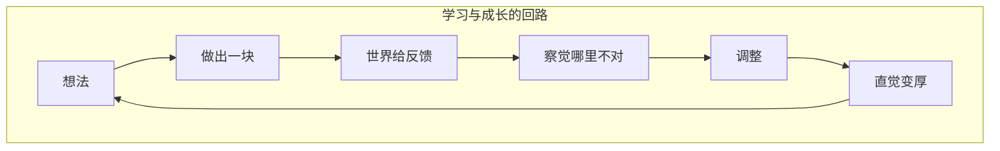

看完 Cursor 设计负责人 Ryo Lu 在 Compile 26 的演讲 [Closer to the Material](https://www.youtube.com/watch?v=az6OEZV8iHw)，我脑子里反复转着一句话：**Building is not producing artifacts. It is a bet on what kind of world should exist.** 建造不是在交付一个成品，而是在押注——你希望存在的是什么样的世界。

从想法到现实，中间隔着一条必须走完的路：迭代、反馈、一点点磨，最终才能落地。这不是「想清楚了再动手」的单向流程，而是一条回路。

## 做的人才是想的人

**Doers are thinkers。** 动手的人不是只会执行的体力劳动者；正是在这条回路里，判断力、品味和责任感才会长出来。反过来，空想不做就是眼高手低——想法再漂亮，没有材料上的来回，就只是不切实际。

学习发生在过程里，不在 PPT 里。你做出一块，世界给你反馈；你察觉哪里不对——间距技术上正确但光学上不对，文案说了正确的事但不是真实的事——然后调整。那一小步修正，才是直觉变厚的地方。Ryo 自己做 **ryOS** 就是这样：过去「怀念电脑像游乐场」的念头只会停在笔记里；现在他可以做出一块、玩一下、改一个细节、再试，直到 ryOS 变成一个**可以在里面思考的地方**。

## AI 加速了回路，但不意味着交给 Agent

过去这条回路很慢、很贵。想法要先翻译成 spec，设计师画稿，工程师实现，PM 评审，QA 测试——犯错成本高，所以大家在碰材料之前就要尽量「想对」。现在 AI 把回路压短了：想法到可运行的切片，有时只要几分钟甚至几秒。**Close the gap between idea and reality**——这是 AI 真正改变的地方。

但这不意味着要把整条回路 handover 给 Agent。

当回路被藏起来，人就拿不到反馈。你许愿，机器消失，带回来一个产出——成了不知道为什么，败了不知道哪里错。人退化成 **watcher 和 approver**：看着 Agent 跑，最后在表面盖章。这不是建造，是抽奖。

作品也会跟着退化。模型在训练里为了拟合数据分布，最终学到的是 **average**——统计意义上的「像大多数样本那样」。如果人不是 author，只是审批者，产出的就是可运行的平庸：按钮能点，页面能渲染，demo 能过，但没有独特性。

Ryo 引了一段 Steve Jobs 谈早期 Mac 的话：界面曾让人觉得在触摸某种活着的东西——Dock 会弹、Genie 效果划过、Exposé 把窗口撒成桌上的牌。都不是必要功能，但你能感到背后有人在乎。后来很多软件变得更顺、更快、更一致，却 somehow 更无趣；怪癖因不好测被拿掉，温度因不可量化被裁掉。

**When building is cheap, slop is free too.** 所谓 taste，本质上就是独特性——那种奇怪的、具体的、个人的东西，没法被平均出来。品味不是 prompt，在乎不是 parameter。

如果人不是 author，回路里的 struggles 就消失了：没有反馈，没有试错，就没有成长，就学不会 taste 和 craft。

## Agent 是工具，帮你成为 Author

所以 Agent 的定位应该是工具：**accelerate materials 的 generation**，扫清障碍，帮人成为 author——而不是替人当作者。

障碍因人而异，工具该扫的是各自的墙：

| 角色 | 过去的墙 | Agent 扫清什么 |
|------|----------|----------------|
| 设计师 | 想法到可交互原型之间隔着实现 | 更接近材料，拧那一个让手感对的细节 |
| 新手 | 不知道从哪行代码开始 | 慢下来读计划，从可见的过程里学 |
| 资深工程师 | 探索架构方向的体力成本 | 让 agent 流动，在关键处跳进去 |

## 自动化与介入的平衡：渐进式披露

我们需要在 AI 自动化与人类介入迭代之间取得平衡，不能因噎废食——拒绝自动化很蠢，永远手动盯每一步也很累。

Cursor 的 UX 设计走的就是这条路：**渐进式披露（progressive disclosure）**。对话过程中暴露必要的细节；用户可以自己选择查看中间的某个步骤；artifacts 可以随时查看、介入、修改。自主化的同时，把选择权留给用户。

Ryo 把这套界面原则内部称为 **Glass**——不是毛玻璃视觉风格，而是让你看穿系统正在做什么：计划、工具流、变更、命令，想深看就深看，想放手就放手。黑盒优化干净的产出；Glass 优化人的能动性。黑盒把软件降格成「一个愿望 + 一个判决」；Glass 把软件变成黏土。

目标是更快的 **contact with materials**——更快的学习、更快的分歧、更快的协作、更快的确信（conviction）。**让思考发生在迭代中**，而不是做之前写尽的 spec 里。

人们需要的不是一个只会生产代码的 AI，而是一个 **environment where humans are authors, not approvers and watchers**。Cursor 也不想做成 single-purpose app——Ryo 在 Notion 时在乎的是简单原语能变成工作的形状；在 Cursor，他在乎的是一套 primitives，让用户使用 Cursor 的方式本身，就能塑造成他们自己工作的形状。

## 手艺搬到了上下游

在这个设计下，手艺没有消失，只是搬到了上下游，回归更本质的东西：

| 方向 | 手艺落在哪 | 具体是什么 |
|------|------------|------------|
| **上游** | 判断 | 该要什么、该留下什么、该拒绝什么、哪里该慢下来、什么根本不该做 |
| **下游** | 责任 | 我们发布了什么、它改变了什么、它服务了谁、它让什么变得更容易 |

Agent 可以执行回路、复制回路、一次做十个一百个一千个版本——但它们不知道什么值得保护，不知道「技术上正确但感觉死了」是什么，也不知道一个产品正在悄悄把我们拉向哪种未来。这些仍然是人要承担的。

## 写在最后

Compile 26 这场演讲从 ryOS 里的一则小笔记开始，到结束时笔记已经变了——不是因为想法变完美了，是因为它变真了。

工具会变，模型会变，经济学会变。有一件事没变：你感到哪里不对，留下一道痕迹，世界给你回应，你把它做真，有一天它真到能触动另一个人。

That's why doers are thinkers. AI 的意义不是让人类消失，而是让更多人进入那条回路——作为 author，而不是 watcher。

产品不应该只是更快、更便宜。若我们做对，未来会更有人味。
