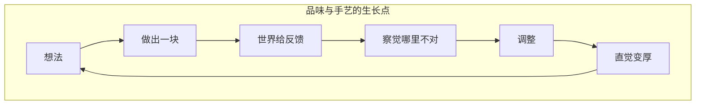

AI 把「有个想法」和「做出个东西」之间的距离压到几乎为零。很多人因此把工具当成更快的产出机器——多写代码、多 ship 功能、多生成原型。但 Cursor 设计负责人 Ryo Lu 在 Compile 26 的演讲 [Closer to the Material](https://www.youtube.com/watch?v=az6OEZV8iHw) 里，把问题拧到了另一个方向：**当执行变便宜，我们真正会失去什么？**

我的答案是：不是手艺本身，而是**通过「做」来思考**的那条回路。Doers are thinkers——动手的人不是只会执行，正是在与材料的反复接触里，判断力、品味和责任感才会长出来。

## 黑盒让你变成审批者，材料让你留在回路里

Ryo 区分了两个词：**output（产出）** 和 **material（材料）**。

| | Output | Material |
|---|--------|----------|
| 与你的关系 | 给你答案，回路结束 | 邀请你回来继续摸 |
| 典型交互 | 许愿 → 等待 → 接受/拒绝 | 触摸、塑形、再试 |
| 你学到什么 | 成了不知道为什么，败了不知道哪里错 | 在试错里积累直觉 |
| 人的角色 | 审批者（approver） | 作者（author） |

黑盒模式很舒服：你说一句需求，机器消失，带回来一个「看起来对」的东西。按钮能点，页面能渲染，demo 能过——但你从未进入决策本身，只是在表面盖章。

这不是建造，是拉老虎机。

而材料思维不同。Ryo 用自己做 **ryOS** 的经历说明：过去这类「怀念电脑像游乐场」的念头只会停在笔记和草图里；现在他可以做出一块、玩一下、发现哪里不对、让 Cursor 改一个细节、再试——循环越来越快，直到 ryOS 不再只是 vibe-coded 的 soundboard，而变成**一个可以在里面思考的地方**。

关键不在「做出来了」，而在**做出来之后你注意到了什么**：间距技术上正确但光学上不对；文案说了正确的事但不是真实的事。这些细微的「不对」，只有东西存在之后才会浮现——然后你改它。那一小步修正，才是判断力成形的地方。

所以 AI 更深层的承诺，不是帮更多人**产出**更多东西，而是让更多人**进入**这条回路，想进多深进多深。设计师可以更接近实现，工程师可以更快试探架构方向，从未写过代码的人也能把脑海里的第一版做出来——**做，才是想的方式**。

## Glass：自动化不必藏起过程

当回路被藏起来，人就停止从回路里学习。Ryo 在 Cursor 推动的 **Glass** 界面原则，正是对这一风险的回应——这里的 Glass 不是毛玻璃视觉风格，而是**让你看穿系统正在做什么**。

黑盒优化的是干净的产出；Glass 优化的是人的能动性（agency）。黑盒把软件降格成「一个愿望 + 一个判决」；Glass 把软件变成黏土——你有权一直贴近材料。

| 场景 | 黑盒 | Glass |
|------|------|-------|
| Agent 跑了几分钟 | 你只能等结果 | 你能看到计划、工具流、变更，随时介入 |
| 资深工程师 | 被迫全盯或全放手 | 让 agent 流动，在关键处跳进去 |
| 设计师 | 只能接受整包输出 | 接受结构，拧那一个让手感对的细节 |
| 新手 | 不知道发生了什么 | 慢下来读计划，从可见的过程里学 |

答案不是拒绝自动化——那很蠢；也不是永远手动参与每一步——那很累。答案是**选择权**：该放手时放手，该贴近时贴近。有些决策不只是任务，而是你的品味进入材料、你的价值变得可见、东西开始像「出自某人之手」的地方。

Ryo 团队用 Cursor 做 Cursor：Glass 从内部原型 Baby Cursor 3 起步，再到可分享的 Baby Glass web 应用。快本身不是重点；**更快的原型让他们更快获得确信**——不靠文档对齐意见，而是靠 demo 看见；不靠远处预测产品，而是靠建造去发现。这又回到了同一条规律：**思考发生在做之中，而不是做之前写尽的 spec 里**。

## 手艺没有消失，只是搬到了上下游

演讲后半段有一个我很喜欢的位移描述。当执行昂贵时，手艺住在执行本身——那一行仔细的代码、精确的布局、改了十二遍的文案。当生成变便宜，手艺**向上游和下游移动**：

- **上游 → 判断**：该要什么、该留下什么、该拒绝什么、哪里该慢下来、什么根本不该做
- **下游 → 责任**：我们发布了什么、它改变了什么、它服务了谁、它让什么变得更容易

Agent 可以执行回路、复制回路、一次做十个一百个一千个版本——但它们不知道什么值得保护，不知道「技术上正确但感觉死了」是什么，也不知道一个产品正在悄悄把我们拉向哪种未来。**这些仍然是人要在做里面承担的。**

Ryo 引了一段 Steve Jobs 谈早期 Mac 的话：界面曾让人觉得在触摸某种活着的东西——Dock 会弹、Genie 效果划过、Exposé 把窗口撒成桌上的牌。都不是必要功能，但你能感到背后有人在乎。后来很多软件变得更顺、更快、更一致，却 somehow 更无趣；怪癖因测不好被拿掉，温度因不可量化被裁掉。现在 AI 让速度变得非人——一下午生成整个产品、午饭前 ship 功能——**粗制滥造也几乎免费了**。

所以品味不是 prompt，在乎不是 parameter。那种奇怪的、具体的、个人的东西，没法被平均出来。

## 什么时候「靠近材料」反而成了负担

这套叙事有边界，值得说清楚，免得把「必须亲手摸每一行」变成新的教条。

**该偏向产出、少介入的过程：**

- 重复性脚手架、批量迁移、格式整理——价值在结果一致，不在回路里的审美
- 你已经反复验证过的模式，只差执行体力
- 时间窗口极窄、错误成本可接受的一次性脚本

**该坚持材料、拒绝纯黑盒的场景：**

- 产品气质、交互手感、文案「真不真」——这些只有做出来才看得见
- Agent 会改动你不太熟的代码库或权限边界——看不见过程等于看不见风险
- 你在带新人或跨职能协作——可见的计划和 diff 本身就是教材

Ryo 说的 progressive disclosure（渐进披露）也是这个意思：不必读每一行，但**永远可以**；深度是用户的选择，不是工具替你做主。

## 写在最后

Compile 26 这场演讲从 ryOS 里的一则小笔记开始，到结束时笔记已经变了——不是因为想法变完美了，是因为它**变真了**。可以做出一块、用一用、感到哪里不对、改那一个细节、再试。最后东西不再只是脑子里的念头，而成了别人也能看见、触摸、走进去的场所。

工具会变，模型会变，经济学会变。有一件事没变，也不会变：

你感到哪里不对 → 你留下一道痕迹 → 世界给你回应 → 你把它做真 → 有一天它真到能触动另一个人。

That's why doers are thinkers. 不是先想清楚了再动手，而是在与材料的短回路里，想与做才合成同一件事。AI 的意义不是让人类消失，而是让更多人感受到那句老话：**我觉得这东西该存在——而且我能把它做真。**

若我们做对，未来不会只是更快，而是更有人味。
