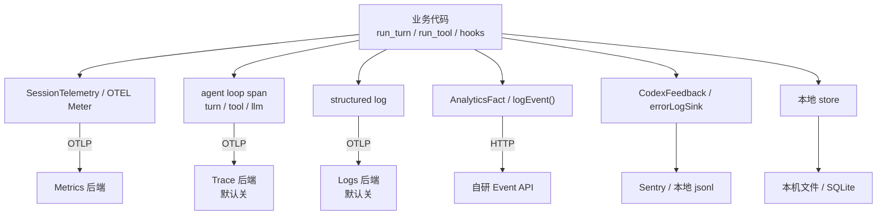
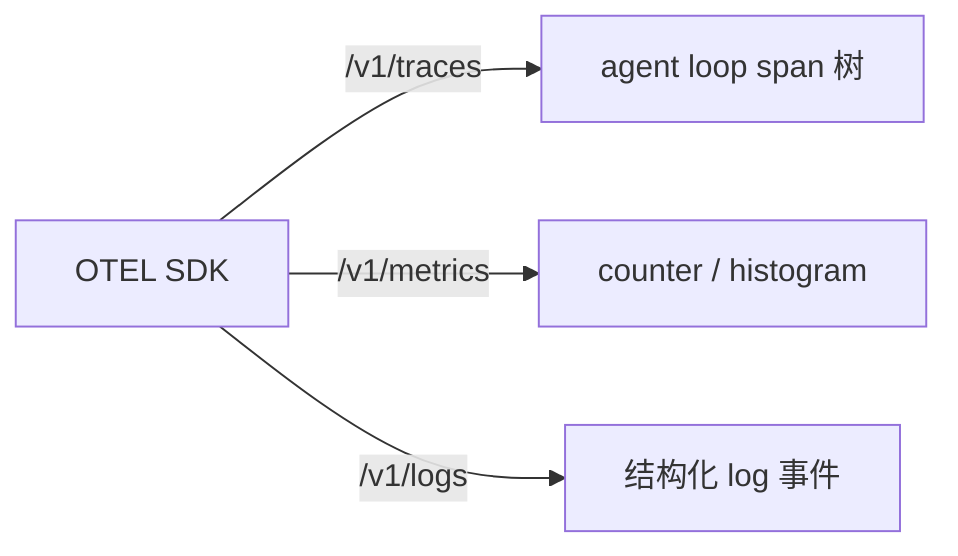
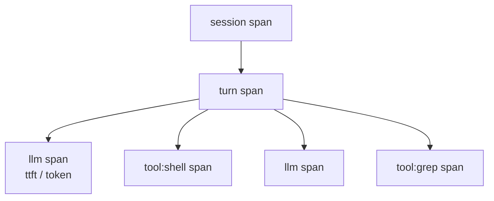
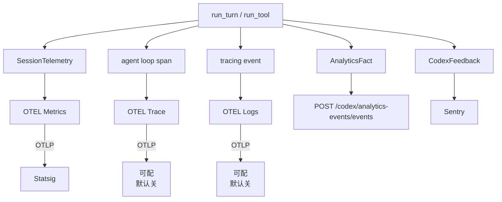
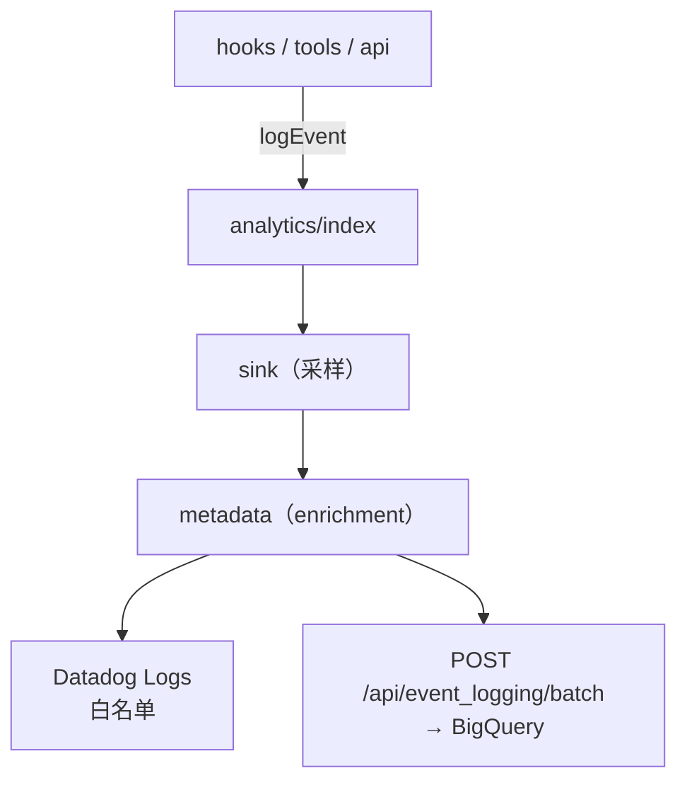
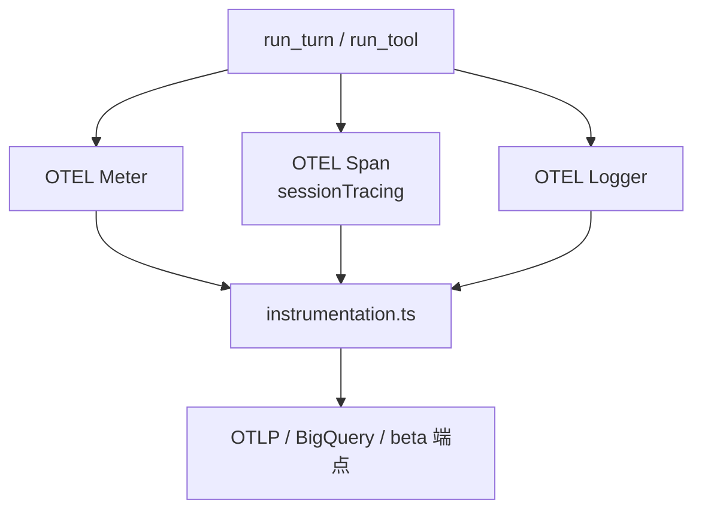

当 coding agent 从「偶尔调 API」变成「常驻终端、改仓库、跑 shell」时，工程问题不再是「能不能打出一条 log」，而是：**同一轮 turn 里，产品要看行为漏斗、SRE 要看 P99 延迟、安全要看敏感链路、用户报 bug 时要能挂上现场——这些信号能不能各走各的路，又不让业务代码变成 if/else 选厂商？**

这篇用 Codex 与 Claude Code 两条已落地的管线做对照，归纳当下 coding agent 可观测性的常见分法：**收什么、埋在哪、怎么导出**。读完后你能判断：该用 OTEL 还是自研 event API、默认开什么、以及哪里不该混成一条管道。

## 先划边界：五类信号，五个问题

Coding agent 的可观测性，本质上是在回答五个不同的问题：

| 信号 | 回答的问题 | 典型内容 | 谁最关心 |
|------|-----------|---------|---------|
| **Metrics** | 快不快、稳不稳、贵不贵？ | 延迟、次数、token 用量、错误率 | SRE、成本、容量规划 |
| **Events** | 用户干了什么、漏斗走到哪？ | turn 完成、tool 调用、插件启用 | 产品、增长、功能采用率 |
| **Trace** | 这一轮 agent loop 怎么跑的？ | turn → 推理 → tool → 再推理 的 span 树、每步耗时 | 性能排障、loop 卡在哪 |
| **Logs** | 会话里发生了什么结构化事实？ | turn 状态变迁、配置快照 | 值班、审计、事后复盘 |
| **Feedback** | 用户主动报的个案 | bug 描述、截图、附件 | 客服、质量、个案追踪 |

**记一句：** Metrics 看曲线，Events 看行为，**Trace 看 agent loop 怎么转**，Logs 看事实，Feedback 看个案。

## 行业共识：埋点一次，导出分流

成熟做法的共同点是：**业务只表达「发生了什么」，去向由 Exporter / Sink 配置决定**，而不是在 `run_turn` 里写 `if statsig ... else sentry ...`。

OTEL / OTLP 前置：三个词、三个 URL

| 词 | 人话 |
|----|------|
| **OTEL** | 开放标准 + SDK，在进程内整理 span / metric / log |
| **OTLP** | 发送协议，通常 HTTP POST 到后端 |
| **Resource** | 每批数据的「身份证」：`service.name`、`environment`（三种信号共用） |

三条出口，三个 URL：

在 coding agent 里，Trace 的 span 通常长这样：

进程启动时配一次 Provider，在 `run_turn` / `run_tool` 入口挂 span；换后端改 Exporter，不动业务代码。Codex（Rust）走 `tracing::info_span!` → `tracing-opentelemetry` → OTEL SDK → OTLP；Claude Code 的 `sessionTracing` 同理，是同一套心智模型。

## 案例：Codex 与 Claude Code

两家做法不同，但都是「埋点一次、导出分流」。下面只保留架构。

### Codex

| 信号 | 默认去向 |
|------|---------|
| Metrics | Statsig（OTLP） |
| Events | 自研 HTTP API |
| Trace / Logs | 不上报（可自配 OTLP） |
| Feedback | Sentry |
| 本地 | 文件 / SQLite / rollout |

远端默认只开 Metrics；Events、Feedback、本地各走一路。

### Claude Code

两条管道，名字分开：

**Analytics（默认开）** — 行为事件，`logEvent()` 广撒网：

**Telemetry（需 `CLAUDE_CODE_ENABLE_TELEMETRY=1`）** — OTEL metrics / trace / logs：

Trace 走 `sessionTracing`，记 session → turn → llm / tool 的 loop 树。错误另落本地 `~/.claude/errors/*.jsonl`，不上报。

**对比：** Codex 默认只开 Metrics 远端；Claude Code 默认开 Analytics，Telemetry 需手动开。两家都把 loop Trace 留给 opt-in。

## 自己设计时

- **默认开关**：Metrics + Events 先开；loop Trace、全量 Logs 默认关，用户或企业自配。
- **埋点位置**：`run_turn` / `run_tool` 旁注入；版本、环境等 enrichment 集中一层，业务只传事实。
- **导出分流**：OTEL 收 metrics / trace / logs，Events 走 HTTP batch，Feedback 走 Sentry；换后端改 Exporter，不改业务代码。
