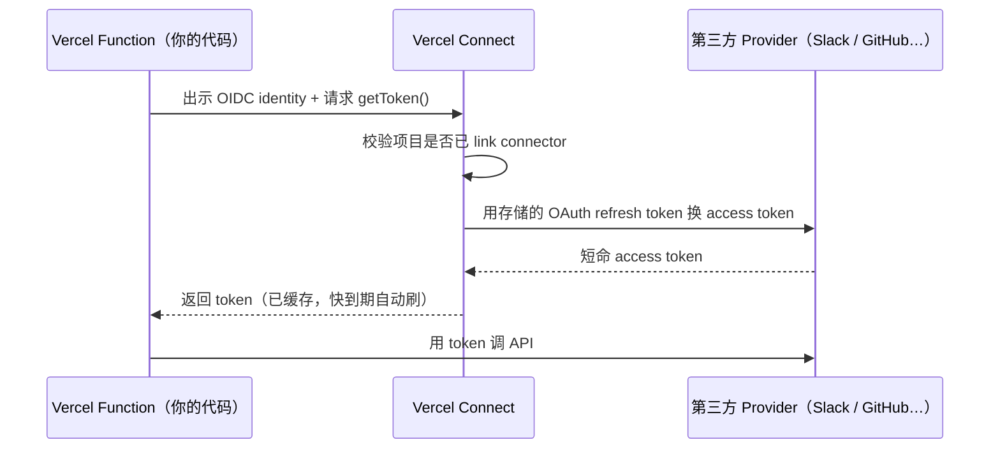
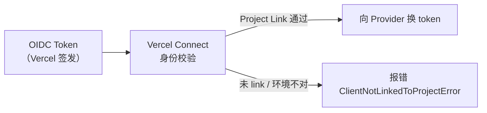
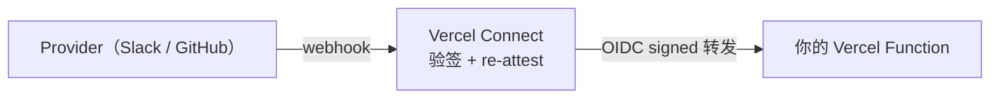

每个接过第三方集成的工程师都遇到过同一个问题：**密钥放哪？** Slack Bot Token、GitHub App 私钥、Snowflake 账号密码——最后大多数都落进了 `.env`，然后进了 CI/CD 的 Secrets，再被几十个人查看过，从没轮换过。

Vercel Connect 的答案是：**不存密钥，按需换取。** 应用在运行时证明自己的身份，Vercel Connect 验证后发给你一个短命 token，用完即弃。

## 一张图看懂全局



整条链路里，**你的代码永远看不到 OAuth client secret 和 refresh token**——它们只存在 Vercel Connect 内部。你的代码只拿到一个寿命几十分钟的 access token。

## 六个原语，由外到内

Vercel Connect 文档把系统分成六个概念，按依赖顺序读：

| 原语 | 一句话 |
|------|--------|
| **Connector** | 团队拥有的一条第三方服务记录，代表「这个团队接入了 Slack / GitHub / …」 |
| **Installation** | 一个 Connector 对应的某个租户授权（某个 Slack workspace、某个 GitHub org） |
| **Token** | 你的代码运行时请求的短命凭证 |
| **Project Link** | 把 Connector 绑定到具体 Vercel 项目 + 环境 |
| **Trigger** | Provider 推来的 webhook，Vercel Connect 验签后转发给项目 |
| **Authentication** | 两条轴：谁在调 Vercel Connect（OIDC），Vercel Connect 怎么向 Provider 证明身份（OAuth） |

这六个原语形成一条流：**创建 Connector → 用户授权形成 Installation → 项目通过 Project Link 被允许请求 → 运行时 getToken() → 拿到 Token 调 API。**

## Step 1：Connector 是什么

Connector 是你注册在 Vercel 团队下的一条服务记录。它不属于某个项目，属于整个团队。

```bash
# CLI 创建一个 Linear Custom OAuth connector
vercel connect create mcp.linear.app --name linear
# 把它绑到当前项目
vercel connect attach oauth/linear
```

几个关键属性：

- **`uid`**：你自己起名，代码里用这个字符串引用（如 `oauth/linear`、`slack/acme-slack`）
- **`type`**：决定认证方式和能力，目前有 `slack`、`github`、`oauth`、`snowflake`、`salesforce`、`api-key`

| Type | 认证方式 | 多租户 | Trigger |
|------|----------|--------|---------|
| Slack | Slack App OAuth（per workspace） | ✓ | ✓ |
| GitHub | GitHub App OAuth（per org/user） | ✓ | - |
| Custom OAuth | 标准 OAuth 2.0 / OIDC + PKCE | - | - |
| API Key | 静态密钥，创建时写死 | - | - |
| Snowflake | Partner Connect JWT | - | - |

## Step 2：OIDC 是整条链的基础

每个部署到 Vercel 的 Function **自动拥有一个 OIDC identity**，不需要手动配置。本地开发时，`vercel env pull` 把 `VERCEL_OIDC_TOKEN` 写进 `.env.local`。

这个 OIDC token 是 SDK 向 Vercel Connect 证明「我是哪个项目、哪个环境下的部署」的凭证。Vercel Connect 收到请求后：

1. 验证 OIDC 签名（颁发者是 Vercel 自己的 OIDC provider）
2. 检查这个项目是否已通过 Project Link 绑定了被请求的 Connector
3. 检查当前环境（production / preview / development）是否被允许

三项都通过，才进入下一步的 token 兑换。



**为什么用 OIDC 而不是 API Key？** OIDC token 是短命的、自动轮换的、带有 claims（项目 ID、环境、部署 ID），API Key 是静态的、需要手动管理。OIDC 更难泄露，泄露了也快过期。

## Step 3：getToken() 的调用模型

```ts
import { getToken } from '@vercel/connect';

// 以 App 身份调用（bot / 服务账户）
const token = await getToken('slack/acme-slack', {
  subject: { type: 'app' },
  installationId: 'inst_workspace_xyz',
  scopes: ['chat:write'],
});

// 以用户身份调用（代用户操作）
const userToken = await getToken('oauth/linear', {
  subject: { type: 'user', id: userId },
  scopes: ['read'],
});
```

三种 subject 类型：

| subject type | 代表谁 | 典型场景 |
|---|---|---|
| `app` | 你的 bot / 服务账户 | 发通知、调租户 admin API |
| `user` | 某个具体用户 | 代用户 PR、代用户发消息 |
| `jwt-bearer` | 外部 JWT 里的 sub | 联合身份，用自有 IDP 换 provider token |

SDK 内部维护一个 **LRU 缓存（100 条）**，同样参数的 token 会被复用，在 token 过期前 30 秒自动刷新。你不需要自己做缓存逻辑。

## Step 4：用户首次授权——同意流

第一次给某个 `userId` 请求 user token，会抛 `UserAuthorizationRequiredError`。这是设计行为，不是 bug：

```ts
import { getToken, startAuthorization, UserAuthorizationRequiredError } from '@vercel/connect';

try {
  const token = await getToken('oauth/linear', {
    subject: { type: 'user', id: userId },
    scopes: ['read'],
  });
} catch (err) {
  if (err instanceof UserAuthorizationRequiredError) {
    // 获取同意跳转链接，重定向给用户
    const { url } = await startAuthorization('oauth/linear', {
      subject: { type: 'user', id: userId },
      scopes: ['read'],
    });
    redirect(url); // 你自己的 redirect 逻辑
  }
}
```

用户点击授权后，Vercel Connect 在服务端完成 OAuth handshake，把 refresh token 存起来。之后同一个 `userId` 再调 `getToken()` 就能直接拿到 token，不再跳转。

## Step 5：Trigger——让 Webhook 进来

Token 是出方向（你调 Provider），Trigger 是入方向（Provider 调你）。

Vercel Connect 作为 webhook 接收端，验签后用 OIDC re-attest 转发给你的项目，相当于给 webhook 加了一层**身份背书**：



目前 Trigger 仅支持 Slack、GitHub、Linear（beta）。

## 与传统做法的对比

| 维度 | 传统 .env 密钥 | Vercel Connect |
|------|----------------|----------------|
| 密钥存储位置 | 你的 CI/CD secrets、团队成员可见 | Vercel Connect 内部，代码不可见 |
| 轮换 | 手动，经常被遗忘 | 自动，access token 短命，refresh token 服务端管 |
| 每用户委托 | 自己做 OAuth、存 refresh token 到数据库 | subject: user，Vercel 托管存储 |
| 泄露影响范围 | 泄一个密钥 = 泄全部权限 | 泄露的只是短命 token，过期即失效 |
| 多租户 | 自己设计 installation 表 | Installation 原语内置 |

## 当前限制（Beta）

- Trigger 仅限 Slack、GitHub、Linear
- Custom OAuth connector 不支持多租户 installation
- token lifetime 和 scope 粒度由 provider 能力上限决定，Vercel Connect 无法突破

## 三条可带走的工程原则

1. **凭证的寿命应该和它的作用范围成反比** — 调一次 API，用一个几十分钟的 token，比用一个永久 secret 安全得多。
2. **平台身份（OIDC）比手工颁发的 API Key 更可信** — 因为它的有效期短、来源可验证、claims 带上下文。
3. **把 OAuth refresh token 托管出去，不是偷懒，是边界清晰** — 你的代码只关心「我能不能调这个 API」，不关心「怎么维持 OAuth 会话」。

Vercel Connect 本质是一个 **凭证代理（Credential Broker）**：用 OIDC 做入站身份，用 OAuth refresh token 做出站身份，中间那层对调用方完全透明。理解这个定位，再看市面上类似的方案（HashiCorp Vault dynamic secrets、AWS IAM Roles Anywhere），会发现思路都在同一条轨道上——**把长期密钥藏在可信系统里，把短命凭证暴露给实际调用方。**
