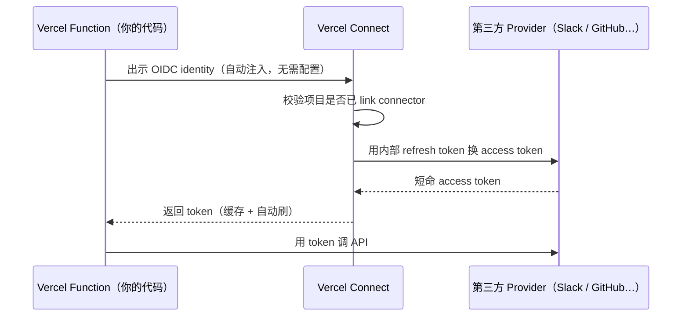
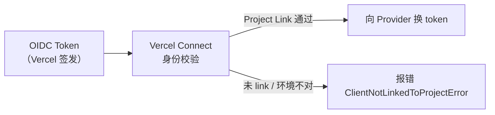

## 问题：密钥必须分发，分发就会泄露

接一个第三方服务，通常是这样开始的：生成一个 token，粘贴进 `.env`，然后继续。几个月后这个 token 同时存在于本地、同事机器、staging、prod CI/CD——从没被轮换过，因为轮换要找到所有副本、逐一更新、重新部署，没人有时间。

这是静态长期凭证的结构性缺陷：**它必须被分发，每多一份就多一个泄露面；泄露了可能很久不知道；一旦泄露，攻击者可以从任何地方使用它。**

Vercel Connect 的答案：**不存密钥，按需换取。** 应用在运行时证明自己的身份，Vercel Connect 验证后发给你一个短命 token，用完即弃。

<details>
<summary>**相关方案：Cursor Cloud Agent 怎么管密钥？**</summary>

Cursor 面对同样的挑战——给 AI agent 安全地提供凭证——但选了一条不同的路：密钥还是存在进程里，但对 LLM 的上下文做过滤。

| 类型 | LLM 上下文可见？ | 脚本/进程可读？ | 适用场景 |
|------|----------------|----------------|---------|
| **Environment Variable** | ✅ 完全可见 | ✅ | 非敏感配置 |
| **Runtime Secret** | ❌ 输出中替换为 `[REDACTED]` | ✅ 技术上可读 | 敏感凭证——脚本能用，LLM 看不到值 |
| **Build Secret** | ❌ 完全隔离 | ❌ | 仅构建阶段，运行时根本不存在 |

| 维度 | Cursor Runtime Secret | Vercel Connect |
|------|----------------------|----------------|
| 长期凭证存在哪 | env var，在进程内存中 | Vercel Connect 内部，代码不可达 |
| 对 LLM 隐藏方式 | 输出过滤（REDACTED） | 从不暴露，根本不在 LLM 能触达的地方 |
| 泄露影响时效 | 长期有效，需手动轮换 | 短命 token，几十分钟自动失效 |

一句话总结：Cursor 的策略是「密钥在进程里，但对 LLM 遮住」；Vercel Connect 的策略是「密钥永远不进进程，LLM 和代码都只拿短命凭证」。

</details>

## 全局链路



你的代码永远看不到 OAuth client secret 和 refresh token——它们只在 Vercel Connect 内部。你的代码只拿到寿命几十分钟的 access token。

## 三个核心原语

| 原语 | 是什么 |
|------|--------|
| **Connector** | 团队层面的一条服务记录，代表「这个团队接入了 Slack / GitHub / …」 |
| **Installation** | 某个 Connector 下的一次租户授权（某个 Slack workspace、某个 GitHub org） |
| **Token** | 运行时 `getToken()` 拿到的短命凭证 |

流程：创建 Connector → 用户授权形成 Installation → 项目通过 Project Link 被允许请求 → 运行时 `getToken()` 拿到 Token → 调 API。

## OIDC：无需预置密钥的身份证明

<details>
<summary>**什么是 OIDC？**</summary>

**OIDC = OpenID Connect**，让 A 向 B 证明「我是谁」的标准协议。你用过「用 Google 登录」吗？那就是 OIDC：你在 Google 登录，Google 告诉你的 App「这个人是 xxx@gmail.com」，并颁发一个带数字签名的 JWT ID Token，接收方可以验证它没被篡改、确实是 Google 签的。

Vercel 把同样的思路用在了**机器身份**上：每个 Vercel Function 部署自动拥有一个 ID Token，里面记着「哪个团队、哪个项目、哪个环境、哪次部署」。

| | API Key | OIDC Token |
|---|---|---|
| 寿命 | 永久，直到手动撤销 | 几分钟到几小时，自动过期 |
| 携带信息 | 只是一串字符 | claims 带上下文（谁、在哪、干嘛） |
| 泄露后 | 永久有效 | 等一会儿自动失效 |
| 颁发方式 | 手动生成、手动分发 | 平台自动注入，不需要人操作 |

</details>

每个部署到 Vercel 的 Function 自动拥有一个 OIDC token，记着「哪个团队、哪个项目、哪个环境、哪次部署」。SDK 把它出示给 Vercel Connect 做身份验证——不需要手动配置任何密钥。

**为什么不直接用 OAuth client_id + client_secret？** `client_secret` 必须预先分发才能使用——存在 `.env`、CI/CD Secrets、配置服务，都一样：为了拿凭证，你先要有一个凭证，而且它会被复制、不会自动过期、泄露后可以从任何地方使用。OIDC workload identity 把「先要有一个凭证」这个前提整个消掉——Vercel 平台在部署时自动签发身份证明，泄露了也几分钟后自动失效。



## getToken() 的调用模型

```ts
import { getToken } from '@vercel/connect';

// 以 App 身份调用（bot / 服务账户）
const token = await getToken('slack/acme-slack', {
  subject: { type: 'app' },
  installationId: 'inst_workspace_xyz',
  scopes: ['chat:write'],
});

// 以用户身份调用（首次会抛 UserAuthorizationRequiredError，引导用户完成 OAuth 同意流后，后续可直接拿 token）
const userToken = await getToken('oauth/linear', {
  subject: { type: 'user', id: userId },
  scopes: ['read'],
});
```

SDK 内部维护 LRU 缓存（100 条），同参数 token 会被复用，过期前 30 秒自动刷新，不需要自己做缓存逻辑。

## 写在最后

1. **凭证寿命应和作用范围成反比** — 几十分钟的 token 比永久 secret 安全得多，泄露了等一会儿自动失效。
2. **平台身份比手工颁发的 API Key 更可信** — 有效期短、来源可验证、claims 带上下文，从外部伪造不了。
3. **把 OAuth refresh token 托管出去，是边界清晰** — 你的代码只关心「我能不能调这个 API」，不关心「怎么维持 OAuth 会话」。

Vercel Connect 本质是一个**凭证代理（Credential Broker）**：用 OIDC 做入站身份，用 OAuth refresh token 做出站身份，中间那层对调用方完全透明。HashiCorp Vault dynamic secrets、AWS IAM Roles Anywhere 思路一致——把长期密钥藏在可信系统里，把短命凭证暴露给实际调用方。
