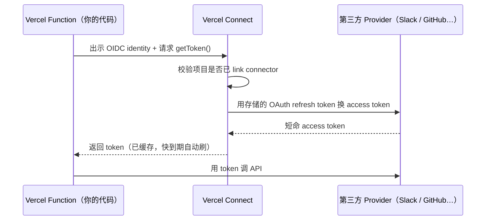
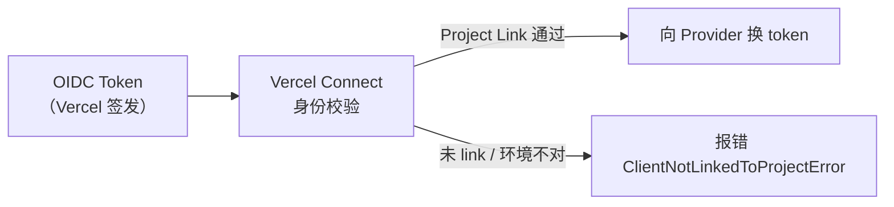
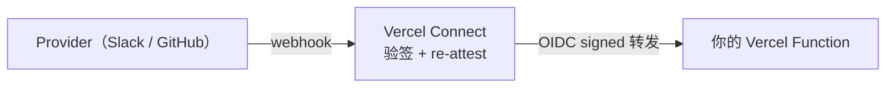
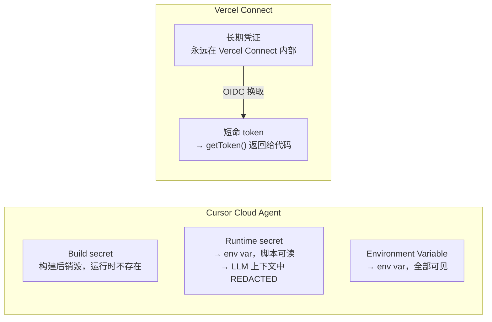

## 背景

接一个第三方服务，通常是这样开始的：去 Slack 或 GitHub 生成一个 token，粘贴进 `.env`，写进 README「记得配这个环境变量」，然后继续下一件事。

几个月后，这个 token 同时存在于：本地 `.env`、同事的 `.env`、staging 的环境变量、prod 的 CI/CD Secrets，也许还有某个被遗忘的截图或 Slack 消息。它从没被轮换过，因为轮换意味着找到所有用它的地方、同步更新、重新部署——没人有时间做这件事，直到出了安全事故。

这不是少数团队的问题，而是**静态长期凭证**的结构性缺陷：

- 它必须被分发到所有需要它的地方，每多一份就多一个泄露面
- 它没有过期机制，泄露了可能很久都不知道
- 一旦泄露，攻击者可以从任何地方、以任何身份使用它

传统的应对方式是把密钥「存得更安全一点」——加密存储、权限收紧、定期审计。这些都有用，但治标不治本：**问题不在于密钥存在哪，在于密钥需要长期存在这件事本身。**

Vercel Connect 的答案是换一个思路：**不存密钥，按需换取。** 应用在运行时证明自己的身份，Vercel Connect 验证后发给你一个短命 token，用完即弃。没有需要分发的密钥，没有需要轮换的密钥，泄露了也几十分钟后自动失效。

<details>
<summary>**前置知识：什么是 OIDC？**</summary>

**OIDC = OpenID Connect**，一句话：让 A 向 B 证明「我是谁」的标准协议。

你用过「用 Google 登录」吗？

```
[你的 App] → 跳转 Google → 你在 Google 登录 → Google 告诉 App「这个人是 xxx@gmail.com」
```

这整套流程就是 OIDC。Google 是**身份提供方（IdP）**，你的 App 信任 Google 的背书。

Google 验证完后，会发一个 **JWT 格式的 ID Token**，里面有：

```json
{
  "iss": "https://accounts.google.com",
  "sub": "user_12345",
  "aud": "your-app-client-id",
  "exp": 1718000000
}
```

Token 有**数字签名**，接收方可以验证它没被篡改、确实是 Google 签的。

**Vercel 把同样的思路用在了机器身份上：** 每个 Vercel Function 部署会自动拿到一个 ID Token，token 里记着「哪个团队、哪个项目、哪个环境（production / preview）、哪次部署」。调 `getToken()` 时，SDK 把这个 token 出示给 Vercel Connect 做身份验证——不需要你手动配置任何密钥。

| | API Key | OIDC Token |
|---|---|---|
| 寿命 | 永久，直到手动撤销 | 几分钟到几小时，自动过期 |
| 携带信息 | 只是一串字符 | claims 带上下文（谁、在哪、干嘛） |
| 泄露后 | 永久有效 | 等一会儿自动失效 |
| 颁发方式 | 手动生成、手动分发 | 平台自动注入，不需要人操作 |

</details>

## 一张图看懂全局



整条链路里，**你的代码永远看不到 OAuth client secret 和 refresh token**——它们只存在 Vercel Connect 内部。你的代码只拿到一个寿命几十分钟的 access token。

## 六个原语，由外到内

Vercel Connect 文档把系统分成六个概念，按依赖顺序读：

| 原语 | 一句话 |
|------|--------|
| **Connector** | 团队拥有的一条第三方服务记录，代表「这个团队接入了 Slack / GitHub / …」 |
| **Installation** | 一个 Connector 对应的某个租户授权（某个 Slack workspace、某个 GitHub org） |
| **Token** | 你的代码运行时请求的短命凭证 |
| **Project Link** | 把 Connector 绑定到具体 Vercel 项目 + 环境 |
| **Trigger** | Provider 推来的 webhook，Vercel Connect 验签后转发给项目 |
| **Authentication** | 两条轴：谁在调 Vercel Connect（OIDC），Vercel Connect 怎么向 Provider 证明身份（OAuth） |

这六个原语形成一条流：**创建 Connector → 用户授权形成 Installation → 项目通过 Project Link 被允许请求 → 运行时 getToken() → 拿到 Token 调 API。**

## Step 1：Connector 是什么

Connector 是你注册在 Vercel 团队下的一条服务记录。它不属于某个项目，属于整个团队。

```bash
# CLI 创建一个 Linear Custom OAuth connector
vercel connect create mcp.linear.app --name linear
# 把它绑到当前项目
vercel connect attach oauth/linear
```

几个关键属性：

- **`uid`**：你自己起名，代码里用这个字符串引用（如 `oauth/linear`、`slack/acme-slack`）
- **`type`**：决定认证方式和能力，目前有 `slack`、`github`、`oauth`、`snowflake`、`salesforce`、`api-key`

| Type | 认证方式 | 多租户 | Trigger |
|------|----------|--------|---------|
| Slack | Slack App OAuth（per workspace） | ✓ | ✓ |
| GitHub | GitHub App OAuth（per org/user） | ✓ | - |
| Custom OAuth | 标准 OAuth 2.0 / OIDC + PKCE | - | - |
| API Key | 静态密钥，创建时写死 | - | - |
| Snowflake | Partner Connect JWT | - | - |

## Step 2：OIDC 是整条链的基础

每个部署到 Vercel 的 Function **自动拥有一个 OIDC identity**，不需要手动配置。本地开发时，`vercel env pull` 把 `VERCEL_OIDC_TOKEN` 写进 `.env.local`。

这个 OIDC token 是 SDK 向 Vercel Connect 证明「我是哪个项目、哪个环境下的部署」的凭证。Vercel Connect 收到请求后：

1. 验证 OIDC 签名（颁发者是 Vercel 自己的 OIDC provider）
2. 检查这个项目是否已通过 Project Link 绑定了被请求的 Connector
3. 检查当前环境（production / preview / development）是否被允许

三项都通过，才进入下一步的 token 兑换。



**为什么用 OIDC，而不是直接用 OAuth client_id + client_secret？**

「用 OAuth 机器对机器的 Client Credentials Flow 不行吗？」完全可以——问题在于 `client_secret` 本身存在哪。它必须提前分发到 Function 能读到的地方：`.env`、CI/CD Secrets、某个配置服务。这是典型的「先有鸡还是先有蛋」：为了拿凭证，你先要有一个凭证。

而且静态长期凭证有三个结构性问题，和存在哪里无关：

**1. 它会被复制**
一个 `client_secret` 从生成到使用，要经过：你生成它 → 粘贴进 CI/CD → 本地 `.env` 一份 → staging 一份 → prod 一份 → 同事本地一份。每多一份就多一个泄露面，CI/CD 只保护了它那一份。

**2. 它不会自动过期**
泄露了你通常不知道。即使知道，轮换意味着找到所有用它的地方、同步更新、重新部署——麻烦到大多数团队从不主动轮换，直到出事。

**3. 它没有上下文，无法细粒度授权**
`client_secret` 被盗后可以从任何地方使用——攻击者的笔记本、他的服务器都能打你的接口。OIDC token 里带着 `environment: production`、`deployment_id: dpl_xxx`，这个签名只有 Vercel 的基础设施能生成，从外部伪造不了。

OIDC workload identity 的思路是：**把「先要有一个凭证」这个前提整个消掉**。Vercel 平台在部署时自动签发身份证明，不需要预置任何密钥，泄露了也几分钟后自动失效。

## Step 3：getToken() 的调用模型

```ts
import { getToken } from '@vercel/connect';

// 以 App 身份调用（bot / 服务账户）
const token = await getToken('slack/acme-slack', {
  subject: { type: 'app' },
  installationId: 'inst_workspace_xyz',
  scopes: ['chat:write'],
});

// 以用户身份调用（代用户操作）
const userToken = await getToken('oauth/linear', {
  subject: { type: 'user', id: userId },
  scopes: ['read'],
});
```

三种 subject 类型：

| subject type | 代表谁 | 典型场景 |
|---|---|---|
| `app` | 你的 bot / 服务账户 | 发通知、调租户 admin API |
| `user` | 某个具体用户 | 代用户 PR、代用户发消息 |
| `jwt-bearer` | 外部 JWT 里的 sub | 联合身份，用自有 IDP 换 provider token |

SDK 内部维护一个 **LRU 缓存（100 条）**，同样参数的 token 会被复用，在 token 过期前 30 秒自动刷新。你不需要自己做缓存逻辑。

## Step 4：用户首次授权——同意流

第一次给某个 `userId` 请求 user token，会抛 `UserAuthorizationRequiredError`。这是设计行为，不是 bug：

```ts
import { getToken, startAuthorization, UserAuthorizationRequiredError } from '@vercel/connect';

try {
  const token = await getToken('oauth/linear', {
    subject: { type: 'user', id: userId },
    scopes: ['read'],
  });
} catch (err) {
  if (err instanceof UserAuthorizationRequiredError) {
    // 获取同意跳转链接，重定向给用户
    const { url } = await startAuthorization('oauth/linear', {
      subject: { type: 'user', id: userId },
      scopes: ['read'],
    });
    redirect(url); // 你自己的 redirect 逻辑
  }
}
```

用户点击授权后，Vercel Connect 在服务端完成 OAuth handshake，把 refresh token 存起来。之后同一个 `userId` 再调 `getToken()` 就能直接拿到 token，不再跳转。

## Step 5：Trigger——让 Webhook 进来

Token 是出方向（你调 Provider），Trigger 是入方向（Provider 调你）。

Vercel Connect 作为 webhook 接收端，验签后用 OIDC re-attest 转发给你的项目，相当于给 webhook 加了一层**身份背书**：



目前 Trigger 仅支持 Slack、GitHub、Linear（beta）。

## 横向对比：Cursor Cloud Agent 也解这个问题

Cursor Cloud Agent 面对同样的挑战——给一个 AI agent 安全地提供凭证——但选了一条不同的路。

Cursor 实际上有**三种**密钥类型（见 [Secret Protection 文档](https://cursor.com/cn/docs/cloud-agent/security-network#secret-protection)）：

| 类型 | LLM 上下文可见？ | 脚本/进程可读？ | 适用场景 |
|------|----------------|----------------|---------|
| **Environment Variable** | ✅ 完全可见 | ✅ | 非敏感配置、公共 URL、feature flag |
| **Runtime Secret**（原 Redacted Secret） | ❌ 输出中替换为 `[REDACTED]` | ✅ 技术上可读 | 敏感凭证——脚本能用，LLM 看不到值 |
| **Build Secret** | ❌ 完全隔离 | ❌ | 仅构建阶段，运行时根本不存在 |

**Runtime Secret 的保护机制值得单独说：** 它并非让 secret 进不了运行时，而是**输出过滤（output filtering）**——secret 确实作为 env var 存在，进程和脚本可以通过 `process.env.XXX` 访问；但任何时候这个值出现在 tool call results、session logs、commit messages 里，都会被自动替换成 `[REDACTED]`。保护目标是 LLM 的上下文，而不是进程本身的访问权限。



两种模型的**根本差异**在于保护边界画在哪里：

| 维度 | Cursor Runtime Secret | Vercel Connect |
|------|----------------------|----------------|
| 长期凭证存在哪 | env var，在进程内存中 | Vercel Connect 内部，代码不可达 |
| 对 LLM 隐藏方式 | 输出过滤（REDACTED） | 从不暴露，根本不在 LLM 能触达的地方 |
| 对脚本/进程可见 | ✅ 可读 | ✅ 可读短命 token，但不是长期凭证 |
| 凭证泄露路径 | 进程内存转储、终端历史 | 几乎没有（长期凭证不在运行时） |
| 泄露影响时效 | 长期有效，需手动轮换 | 短命 token，几十分钟自动失效 |

两种设计各有其取舍。Cursor 的模型务实：脚本不改造照样能用，REDACTED 机制专门针对 LLM 上下文泄露这个最常见威胁向量。Vercel Connect 的模型更彻底：长期凭证压根不进运行时，但代价是所有 API 调用都必须经过 `getToken()` 这个显式换取步骤，旧代码需要改造。

> **一句话总结差异**：Cursor 的策略是「密钥在进程里，但对 LLM 遮住」；Vercel Connect 的策略是「密钥永远不进进程，LLM 和代码都只拿短命凭证」。

## 与传统做法的对比

| 维度 | 传统 .env 密钥 | Vercel Connect |
|------|----------------|----------------|
| 密钥存储位置 | 你的 CI/CD secrets、团队成员可见 | Vercel Connect 内部，代码不可见 |
| 轮换 | 手动，经常被遗忘 | 自动，access token 短命，refresh token 服务端管 |
| 每用户委托 | 自己做 OAuth、存 refresh token 到数据库 | subject: user，Vercel 托管存储 |
| 泄露影响范围 | 泄一个密钥 = 泄全部权限 | 泄露的只是短命 token，过期即失效 |
| 多租户 | 自己设计 installation 表 | Installation 原语内置 |

## 当前限制（Beta）

- Trigger 仅限 Slack、GitHub、Linear
- Custom OAuth connector 不支持多租户 installation
- token lifetime 和 scope 粒度由 provider 能力上限决定，Vercel Connect 无法突破

## 三条可带走的工程原则

1. **凭证的寿命应该和它的作用范围成反比** — 调一次 API，用一个几十分钟的 token，比用一个永久 secret 安全得多。
2. **平台身份（OIDC）比手工颁发的 API Key 更可信** — 因为它的有效期短、来源可验证、claims 带上下文。
3. **把 OAuth refresh token 托管出去，不是偷懒，是边界清晰** — 你的代码只关心「我能不能调这个 API」，不关心「怎么维持 OAuth 会话」。

Vercel Connect 本质是一个 **凭证代理（Credential Broker）**：用 OIDC 做入站身份，用 OAuth refresh token 做出站身份，中间那层对调用方完全透明。理解这个定位，再看市面上类似的方案（HashiCorp Vault dynamic secrets、AWS IAM Roles Anywhere），会发现思路都在同一条轨道上——**把长期密钥藏在可信系统里，把短命凭证暴露给实际调用方。**
